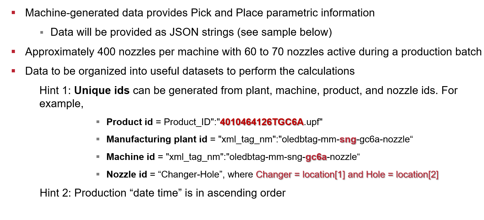

# Data Acquisition and Preparation

Approximately 400 nozzles per machine with 60 to 70 nozzles active during production

Machine-generated provides Pick and Place parametric information

- Data will be provided as JSON strings

Data to be organized into useful dataset to perform the calculations



### Sample JSON String
``` { "xml_tag_nm":"oledbtag-mm-sng-gc6a-nozzle“ ,"Product_ID":"4010464126TGC6A.upf","xml_stat_cd":"192","xml_tag_id":"100015","bicoe_load_dttm":"2019-07-20T22:11:00.229Z","file_timestamp":"2019-07-20T22:10:37.0696354Z000000000000000","hdfs_file_name":"pap_1563660660113","file_name":"twb-2002-100015-2019-07-20T22-10-37.098Z0000000000000394","Date_Time":"2019-07-21T06:00:02.0000000Z","User_Name":"FZ4-120B015MODA$","location":"0,0,11","tooltype":722575810,"ulpicks":42,"ulplacements":42,"ulcompmissing":0,"ulcompupsidedown":0,"ulleadlocationfailure":0,"ulleadspacingfailure":0,"ulleaddeviationfailure":0,"ulleadspanfailure":0,"ulcomplocationfailure":0,"ulcompsizefailure":0,"ulfeaturelocationfailure":0,"ulfeaturespacingfailure":0,"ulpitchfailure":0,"ulorientationcheckfailure":0,"ulleadcountfailure":0,"ulballcountfailure":0,"ulfeaturecountfailure":0,"ulPossibleMissing":0,"ulRejects":0,"ulPurged":0,"ulCornerToleranceFailure":0,"ulVPSHeightFailure":0,"ulVPSPartPresenceFailure":0}```


## Measuring a successful Pick and Place
A successful pick and place operation must conclude with an electronic component placement
- ulplacements = ulpicks

Sometimes, a nozzle fails to pick up the electronic component, increasing the # of rejects
- ulplacements = ulpicks - ulrejects


