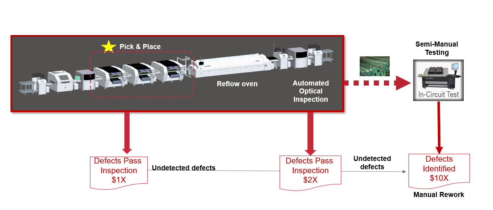
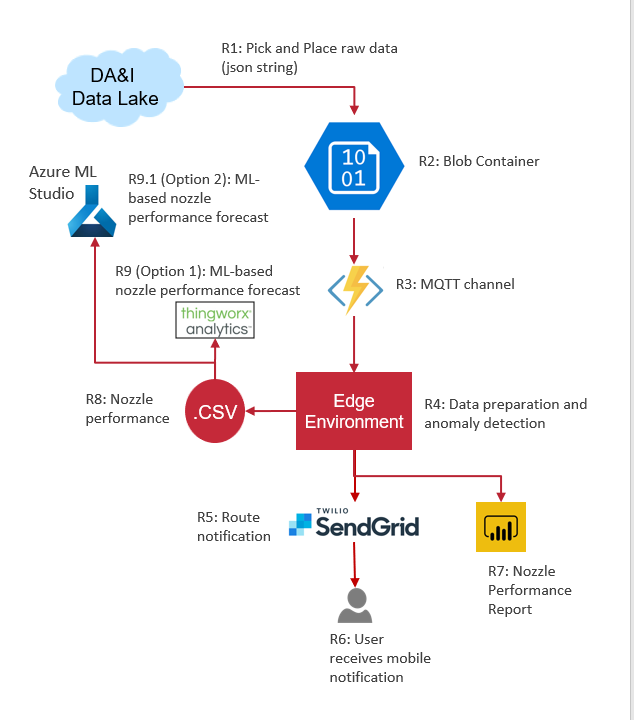
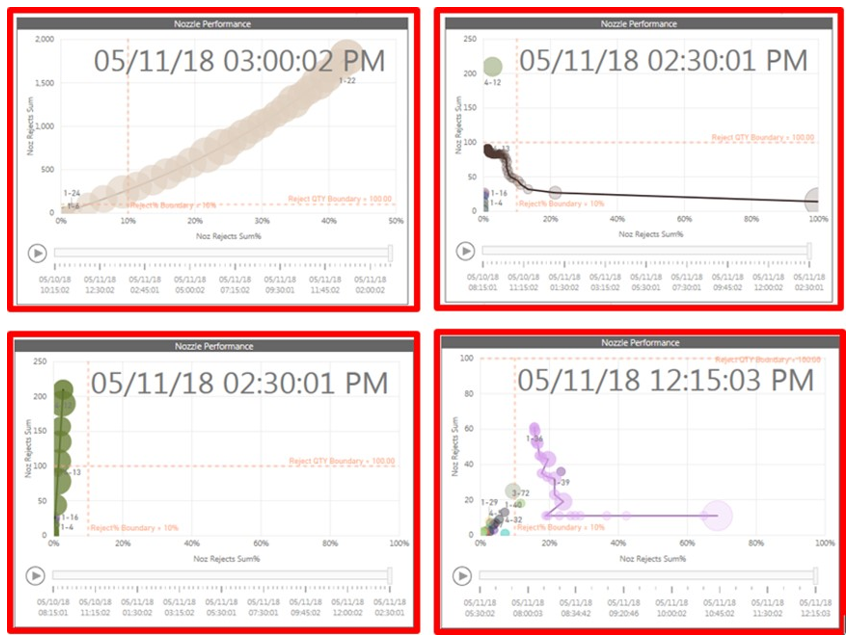

# Rockwell Automation- Pick and Place Nozzle Performance and Prediction
## Data Analytics and Insights Group
# 

## Prompt Background
### Rockwell Automation Electronic Assembly Manufacturing

### Use Case Baseline State
### Reducing Defects in Electronic Assembly Manufacturing of Allen Bradley Products

[Example Pick and Place machine video]("https://www.youtube.com/watch?v=c8cY42-qMcM") 

## Prompt

Evaluate and Produce a Maintainable and supportable solution for detecting anomalies in the Pick and Place nozzles.

Solutions can contain, but are not limited to:
- Storm tracker diagrams (Live PowerBI dashboard)
- Evaluate vector path of nozzle and tabulate a nozzle score over time
- Trigger users when nozzle exceeds threshold of performance
- Parameters to change to adjust sensitivity

#

## Sample Solution/ Architecture
Teams are able to use any tools they wish, however preference will be given to those who use supportable, maintainable tools for an enterprise environment.
A sample architecture is provided below with some technology options.  For the purpose of this prompt, participants must use the provided Azure Blob storage to retrive the data.  This is provided by the DA&I team.
## 

Automatically Detect nozzle flyaway with no user intervention
- Algorithm that evalutates the vector path of each nozzle and tabulates a 'nozzle score' over time
- When a nozzle score reaches a trigger value, additional logic is checked and if satisfied an alert may be sent to a support person.
- Parameters can be changed to adjust sensitivity

### Recommended Technology
# Architecture/ Platforms can be provided if participants choose these technologies

## Advanced Predictive Analytics Modeling
- [FactoryTalk Analytics Edge](FTEdge.md)

## Machine Learning Modeling

- [AzureML](AzureML.md)
- [Thingworx Analytics](Thingworx.md)

## Solution Reporting

- [PowerBI](PowerBI.md)
- [Thingworx Mashups](Thingworx.md)

## Notifications

- [Twilio Sendgrid]("https://www.twilio.com/sendgrid")
- [Thingworx Notifications]("")

## Data Source (Required)
- Azure Blob container
- Json Strings

## Development Tools
- Visual Studio Code (IDE for FT Edge)
- Python Libraries
#

# 
## Blob container, Twilio, PowerBI  (we will use REST API option) 