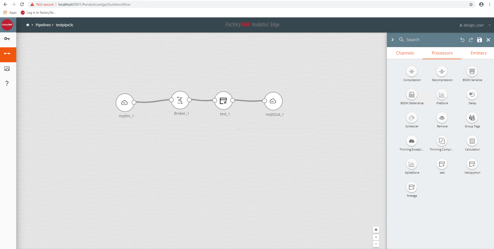

# [FactoryTalk Analytics Edge](https://www.rockwellautomation.com/en_NA/products/analytics/overview.page?pagetitle=FactoryTalk-Analytics-Platform&docid=c76b03a6a882d1802d961e37d1f00bb4)

Low footprint analytics platform capable of real time and batch processing with low latency at the Edge layer.

Supports data ingestion from:
- FactoryTalk Live Data
- CIP
- MQTT
- SQQL

Supports data egress from:
- Kafka
- Cloud Sources
- Socket IO
- MSSQL
- Etc.

Built in processors for data:
- pre-processing
- transformation
- scheduling
- temporary store-forward

Ability to create custom processors and custom user functions.
A pipeline generally consists of a data source, a broker, one or more processors, and an emitter (data egress)

## Pipeline Example

### Documentation
[FT Edge User Guide](Edge_User_Guide.pdf)

# Step by Step TODO: Instructions

1. Open VSCode in the edgedev folder
2. Using Ctrl-Shift-P > Run Task > Export from FTEdge TODO: Fixme
3. Create custom processor in folder ___ to call python file ___ TODO: Fixme
4. Run Task > Import to FT Edge TODO: Fix me
5. Place new custom processor in FTEdge pipeline