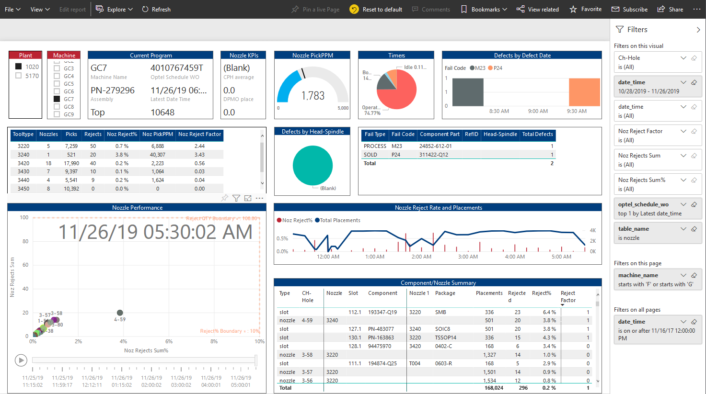
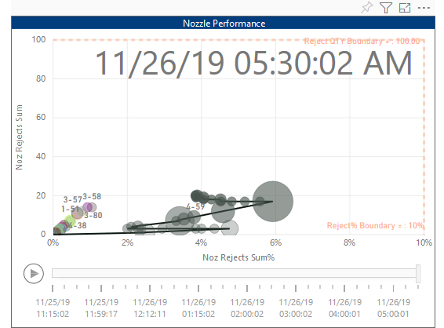

# [PowerBI](https://powerbi.microsoft.com/en-us/) 
If you opt to use PowerBI, you can use a free-trial PowerBI Desktop and service license.

Please provide your .pbix at the end of the Hackathon (you can upload it to the blob container – identify your work group name).

## Sample PowerBI Reports

## Nozzle Performance

## Documentation
- [Power BI Streaming](https://powerbi.microsoft.com/en-us/blog/push-rows-to-a-power-bi-streaming-dataset-without-writing-any-code-using-microsoft-flow/)