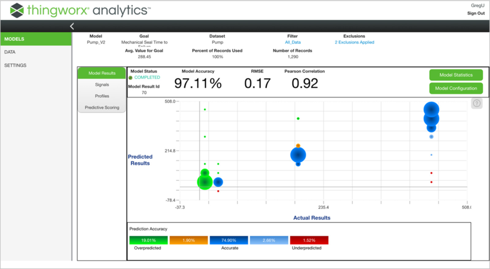

# 
## Thingworx platform and analytics

### Predictive Modeling
Incorporates supervised machine learning into industrial IoT solutions and extends data science practices with automated predictive and prescriptive modeling – without the need for algorithm expertise by users
### Explanatory Analytics
 Enables better understanding of industrial IoT data, providing a variety of advanced algorithms that allows users to discover useful patterns and correlations within data
 ### Real-Time Monitoring
 Monitors data streams using a variety of statistical and machine learning techniques to learn “normal” conditions and identify unexpected changes in behavior
 ### Predictive Scoring
 Anticipates future outcomes and offers the ability to make relevant outcome-based predictions based on data within ThingWorx

## Thingworx Analytics

### Documentation 
- [Thingworx Docs]("https://www.ptc.com/en/support/help/thingworx_doc_resources#twx-platform")
- [Thingworx Analytics]("https://www.ptc.com/en/resources/iiot/product-brief/thingworx-analytics")
- [Thingworx Mashups]("https://www.ptc.com/en/resources/iiot/product-brief/thingworx-platform")
- [Thingworx Analytics Support]("https://support.ptc.com/help/thingworx_hc/thingworx_analytics_52/index.html#page/thingworx_analytics_7%2Fthingworxanalytics-welcome.html%23")